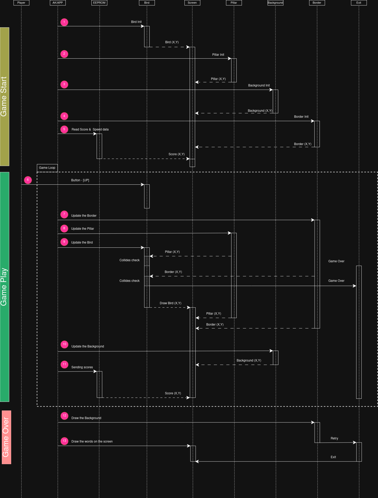
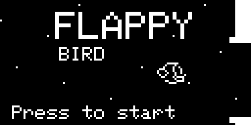
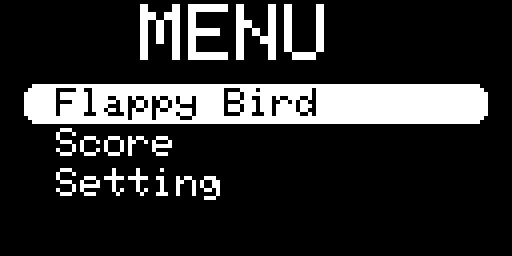
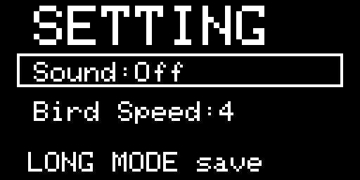

# AK flappy bird Game for AK Embedded Base Kit


<div align="center">
  <video width="500" controls>
    <source src="https://github.com/user-attachments/assets/26fb5207-f02f-4ef4-97e2-a4f5a2ba14ae" type="video/mp4">
  </video>
</div>

<div align="center">

🎮 [Watch Demo Video](https://github.com/user-attachments/assets/26fb5207-f02f-4ef4-97e2-a4f5a2ba14ae)
</div>

This repository contains the firmware for the flappy bird game that runs on the AK Embedded Base Kit with STM32L151. The project is a hands-on example of event-driven embedded programming: the screen, buttons, buzzer, timers, EEPROM, and task scheduler work together to present a complete game loop rather than a single demo screen.

The board is designed for embedded learning and prototyping. It combines a 1.54" OLED display, 3 push buttonsand buzzer so you can study interaction, timing, persistence, and modular firmware architecture on real hardware.

## Quick Start

If you just want to understand the game quickly, this is the shortest path:

1. Build the firmware with `make -C application`.
2. Flash the application to the board at `0x08003000`.
3. Use Mode to enter or confirm.
4. Use Up and Down to move through menus and settings.
5. Enter the flappy bird screen, move the bird up and down.

## Contents

Use this table to jump to major sections in this README.

- [Quick Start](#quick-start)
- [Contents](#contents)
- [How To Read This Project](#how-to-read-this-project)
- [What This Game Is About](#what-this-game-is-about)
- [Main Features](#main-features)
- [Hardware Context](#hardware-context)
- [Memory Map](#memory-map)
- [Game Flow](#game-flow)
- [Game Sequence Logic](#game-flow)
- [Game design](#game-design)
- [Internal Game IDs and Tasks](#internal-game-ids-and-tasks)
- [Settings](#settings)
- [Controls](#controls)
- [Build](#build)

## How To Read This Project

- If you are playing the game, read the game overview, controls, and quick start sections first.
- If you are changing firmware behavior, focus on internal game IDs, task ownership, and settings persistence.
- If you are building or flashing, jump straight to the build and flashing sections.

## What This Game Is About

Flappy Bird is a compact and engaging arcade game designed specifically for the display and controls of the Ak Kit. In this game, players control a small, flappy bird character, navigating it through a series of obstacles (pillars). The objective is to keep the bird flying without crashing into itself or the obstacles, striving to survive as long as possible and achieve the highest score.
The game features intuitive controls allowing players to flap the bird's wings and maneuver it around the screen. As players progress, they receive visual feedback through score updates and animations, enhancing the gaming experience. The Ak Kit's buzzer music adds an auditory layer of fun, providing background tunes and sound effects that keep players engaged.
With its simple yet addictive gameplay, Flappy Bird on the Ak Kit offers a perfect blend of challenge and entertainment, making it ideal for quick gaming sessions or learning about game development on embedded systems.

The important part of this project is not only the gameplay itself, but how the gameplay is split into different tasks:

- AC_BIRD_DISPLAY_ID
- AC_BIRD_INPUT_UP_BUTTON
- AC_BIRD_SCORE
- AC_BIRD_PILLAR

That structure makes the firmware easier to reason about and is a good reference if you are studying cooperative embedded state machines.

## Main Features

- OLED-based flappy bird gameplay with a clean animated screen.
- 3-button control scheme for menu navigation and gameplay.
- Persistent game settings stored in EEPROM.
- Adjustable flappy bird speed from slow to fast.
- Selectable buzzer music loop.
- Buzzer enable or disable option.
- Score tracking and top score flow.
- Event-driven task architecture with timer-based updates.

## Hardware Context

The firmware targets the AK Embedded Base Kit hardware stack:

- STM32L151 MCU.
- 1.54" OLED display (V3) or 1.3" OLED display (V2)
- 3 push buttons.
- Buzzer for sound effects and looping music.
- Additional interfaces on the board such as RS485, Qwiic, and Grove, which are part of the larger platform even when not used directly by the flappy bird game.

### Memory Map

- `0x08000000` - Boot firmware.
- `0x08002000` - Boot/Application shared data region.
- `0x08003000` - Application firmware.

The application is linked to start at `0x08003000` so it matches the boot layout and the shared flash map used by the Ak Kit.

## Game Flow

The game is organized as a screen-driven application:

1. The firmware boots and initializes hardware, tasks, timers, and optional modules.
2. The display shows the main app flow and menu screens.
3. The player enters the flappy bird game screen.
4. The flappy bird is reset, pillars are initialized, score is cleared, and music starts if enabled.
5. The game runs on periodic ticks driven by the scheduler.
6. If the player crashes or wins, the game shows an overlay.
7. The player can move to the score chart screen or back out to the menu.

## Game Sequence Logic

This is the game sequence logic about the Flappy Bird Game.
There are 3 stages: Game Start, Game Play and Game Over. It is all about the sequence of the different stages of the Flappy Bird Game. It shows the steps and alignment of the signals (non-dotted line(s)) and data (dotted line(s)). There are a total of 8 different object used in this game from "Player" to "End". 
<div align="center">
  
</div>

## Game design

The game UI is structured into a few clear screens that guide the player from power-on to gameplay, settings, and score review. Each screen is designed to be compact and readable on the small OLED while providing the player with clear feedback and control.

### Startup Screen
<div align="center">
  
</div>


The startup screen shows the board and firmware identity, provides a brief boot animation and offers entry into the main app menu. It confirms hardware is initialized (display, buttons, buzzer) and gives a short visual cue if saved settings or scores were loaded successfully.

### Menu Screen
<div align="center">
  
</div>

The menu screen is the central hub. Menu entries are arranged vertically and can be navigated with Up/Down; Mode enters or confirms. Visual highlights and simple icons make it easy to pick modes (Start Game, Settings, Charts). Menu animations are subtle to keep the UI responsive.

### Settings Screen
<div align="center">
  
</div>

Settings let the player tune gameplay and audio quickly:

- flappy bird speed: five discrete steps from slow to fast.
- Buzzer: toggle sound on or off.

Controls are mapped consistently so a short hold action loads presets while single presses adjust the selected value.

---

Design notes

- Visual clarity: the renderer uses bold pixels and a clear glyph set so text and icons remain legible on the small OLED.
- Modularity: each gameplay system (flappy bird , pillar, score, collisions) is owned by a separate task, making it easy to change pacing or rules without touching rendering code.
- Accessibility: simple 3-button controls and presets let new players start quickly without digging through menus.

## Internal Game IDs and Tasks

The phrase “game ID” in this codebase is best understood as the internal task ID used by the scheduler. These are not player-facing IDs; they are numeric identifiers that let the firmware route messages to the correct task.

The IDs are declared in [application/sources/app/task_list.h](application/sources/app/task_list.h). 
The main game-related entries are:

- `AC_BIRD_DISPLAY_ID`          - to display the bird game.
- `AC_BIRD_INPUT_UP_BUTTON`     - wher the signal are given to be pressed up and down to control the game.
- `AC_BIRD_SCORE`               - increment or reset the game.
- `AC_BIRD_PILLAR`              - the pillar will spawn and the collision.

The application-level task IDs around them include the system, display, shell, interface, debug, and communication tasks. That split is important because the game is not a standalone loop; it is one module inside a larger embedded runtime.

### Why This Matters

If you are tracing behavior, debugging a screen update, or changing gameplay timing, these IDs tell you which module owns the behavior. For example:

- Movement timing is driven by the flappy bird /game coordinator.
- Pillar behavior is independent from the visual screen code.
- Score updates happen through the score module rather than in the renderer.
- Button events are posted as messages instead of being handled directly in the input callback.

## Settings

The settings screen is one of the most useful parts of the firmware because it shows how user preferences are persisted safely and loaded back on startup.

The available settings are:

- flappy bird speed.
- Buzzer enable or disable.

### flappy bird Speed

Speed is stored as a value from `1` to `5` and mapped to actual tick intervals:

- `1` - 300 ms
- `2` - 240 ms
- `3` - 180 ms
- `4` - 130 ms
- `5` - 90 ms

Higher speed means the flappy bird updates more often and the game becomes harder.

### Buzzer Setting

The buzzer can be turned on or off. When it is off, the game silences sound playback instead of trying to restart it.

## Settings Persistence

Settings are persisted in EEPROM so they survive power cycles. The settings structure includes a magic value plus the current configuration values, and the code validates ranges when loading them back.

That means the firmware does not blindly trust stored bytes. If EEPROM contains invalid data, the code falls back to safe defaults instead of using out-of-range values.

This same pattern is also used for flappy bird score storage, which helps keep saved data structured and easier to verify.

## Controls

The button behavior is simple and consistent across the app:

- Mode button is used for enter, confirm, and back/exit depending on the screen.
- Up and Down buttons move through menu items or game settings.
- Button hold actions are also used for shortcuts on some screens.

In the settings screen:

- Up and Down move the selection.
- Mode toggles the selected setting.
- Holding Mode returns to the game menu.
- Holding Up loads a strong gameplay preset.
- Holding Down loads a minimal gameplay preset.

In the flappy bird screen:

- Up and Down change flappy bird direction.
- Mode exits the screen or opens the score flow after game over.

## Build

Build the application from the repository root:

```sh
make all
```

The generated artifacts are placed under `application/build_flappy_bird/`, including the `.axf` and converted `.bin`, `.out`, and `.elf` files.

### Windows Notes

- `application/make.cmd` exists to make local cleanup easier on Windows.
- A GNU Make binary is still required for full builds.
- Tool paths in the Makefile are configured for the ARM GCC and STM32Cube/OpenOCD setup used by this project.
- If you want to make your README.md to be better resolution photo or gif go to `resource/tools/python3.py` then use that code by going into the root of this project folder and type 
```sh
python3 resources/tools/python3.py -t zoom -v 4 -i image location(old) -o image location (new)
```

## Flashing

After building the bootloader and application, the firmware can be loaded through the normal board flashing flow used by the kit. The repository also supports direct application flashing through the USB path when the boot firmware and the board setup are already in place.

Example:

```sh
ak_flash /dev/ttyUSB0 ak-base-kit-stm32l151-application.bin 0x08003000

or

make flash
```

- `application/` - firmware application sources and build system.
- `boot/` - bootloader-related files.
- `hardware/` - board images, schematics, and manufacturing resources.
- `resources/` - bitmap and asset resources used by the game.

## References

| Topic | Link |
| ------ | ------ |
| Blog & Tutorial | <https://epcb.vn/blogs/ak-embedded-software> |
| Where to buy KIT? | <https://epcb.vn/products/ak-embedded-base-kit-lap-trinh-nhung-vi-dieu-khien-mcu> |
| Schematic | [hardware/schematic/schematic-ak-embedded-base-kit-version-3.pdf](hardware/schematic/schematic-ak-embedded-base-kit-version-3.pdf) |